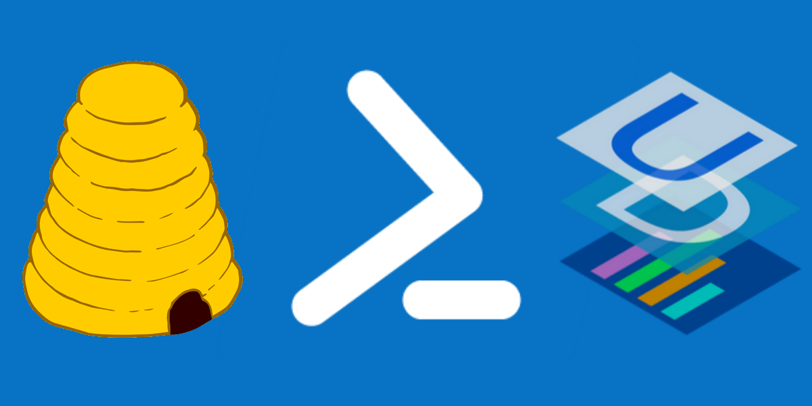
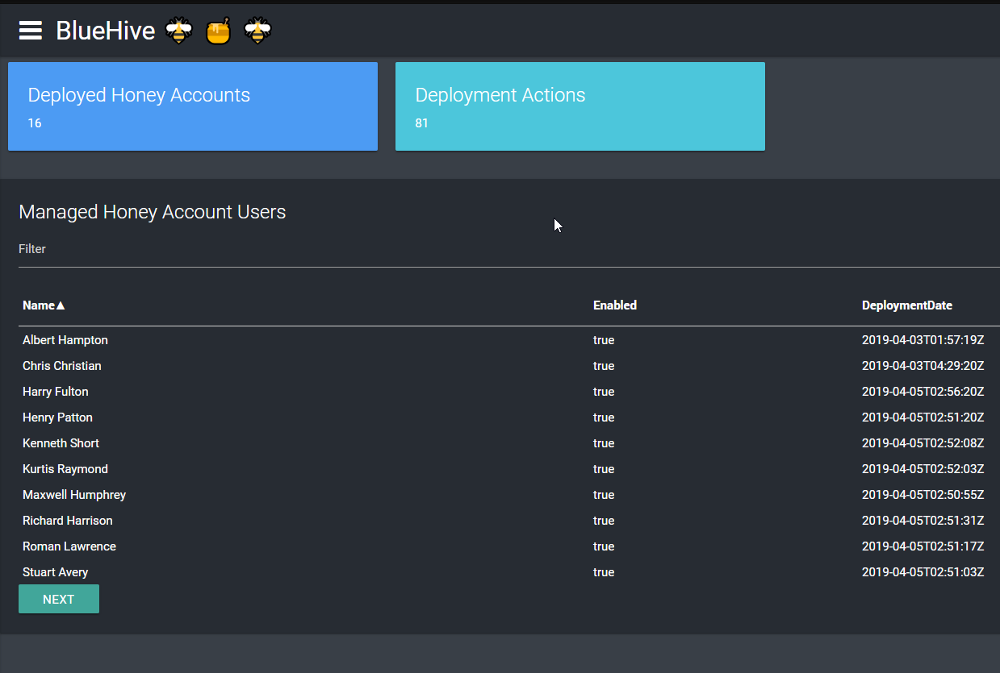
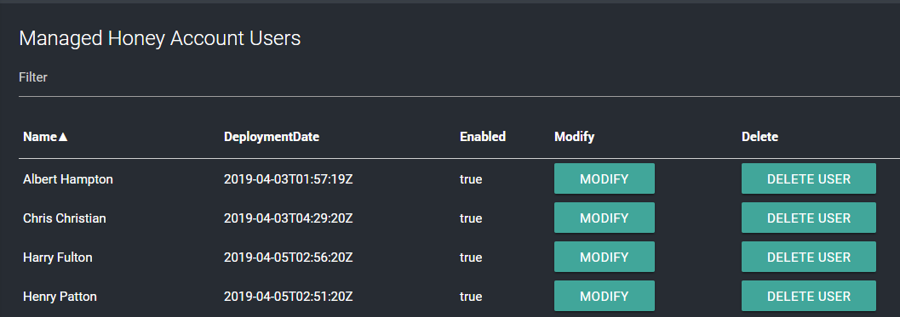
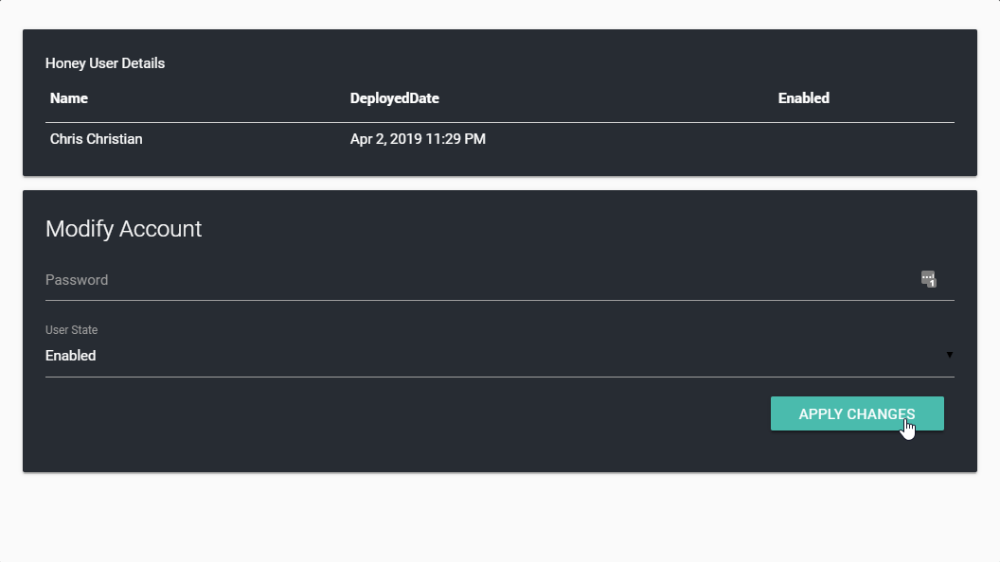
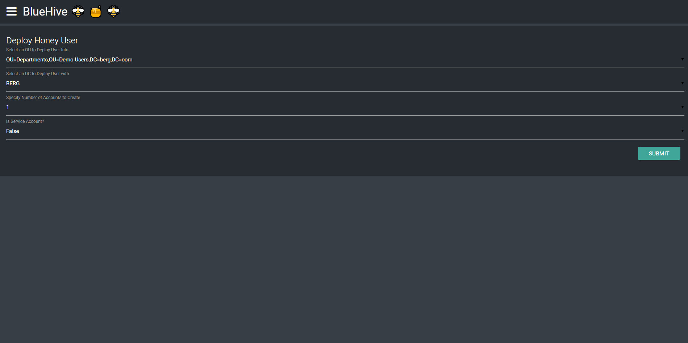

# BlueHive

**Active Directory Honey User Account Management**

**BlueHive** is **HoneyPot User management tool** built with the free open source community edition of [Universal Dashboard](https://universaldashboard.io/) by [Ironman Software](https://ironmansoftware.com). This utility can be used to create and manage Honeypot user and service accounts via an interactive web dashboard.

**WARNING**: This project is intended to be used as a teaching tool for learning [Universal Dashboard](https://universaldashboard.io/) and the basic concepts of Active Directory Honey Pot Users - don't use this in your production :) 🖥 🔥 

**NOTE** : Uses Names files from [Seclists](https://github.com/danielmiessler/SecLists/tree/master/Passwords) as data for the random user / account creation process.

## Screenshots

**Home Page**

**Management Page**

**Modify Honey Account**

**Creating Honey Accounts**

## Features
* Create "Honey Pot" Users with randomized names / properties
  * Users
  * Service Accounts (with SPN)
* Target creation of an account on a specific domain / controller
* **Dashboards** showing status of deployed HoneyPot users
* Management of Honey Pot User (Add/Remove/Modify)
* Track History of Honey User Deployments
* One Click to Remove Honey Users from Active Directory

## Drawbacks / Issues
* Service Accounts will be **BUSTED** by [HoneyPot Buster](https://github.com/JavelinNetworks/HoneypotBuster) - I have not yet implemented a good way to update values like "lastlogontimestamp" to reduce the Fank Rank. **NOTE** - Currently working on implementing a Scheduled Endpoint, that will "Login" with specified accounts on a schedule.
* Data storage via json files on disk 🤷
* Only "half-way" supports multiple domains, needs some data management work needs to be completed
* "OtherName" of created token objects have value of 1337 - this is the identifier for a honey object used by this. Ideally accounts would be independently tracked outside of such a value.
* Many more values in the Ad Objects COULD be populated but are not.
* Some... LESS THAN efficient powershell scripting ;)

## Usage
1. **SETUP** - Populate your own environmental variables in the "start.ps1" script. Specifically the folowing variables:
   * ``$DomainControllerFQDN`` - FQDN of the domain controller bluehive will interact with.
   * ``$BlueHiveFolder`` EX: 'C:\Users\lee\git\BlueHive' - Data Storage for Bluehive
   * ``$AutoLoginServer`` FQDN of servce where new powershell sessions will login with honey accounts (Honey accoutns must have login rights).
2. Use the start script to connect to active directory and startup the dashboard.
3. Open the "Domain Connection" page and initiate a new domain sync by specifying your domain name and clicking the "Sync" button.
4. Verify Domain Information in the "Existing Domain Connection" Pane. **Note - at this point you should have domain data populated in your `Data\Retrieved\Domains` folder
5. Use Deployment Page to deploy new Honey Account
6. Use the Management Page to delete / edit Honey Accounts that have been deployed.
7. Use the dashboard pages to management honey accounts and don't forget to check out the Logs folder for a good old fashion log file.